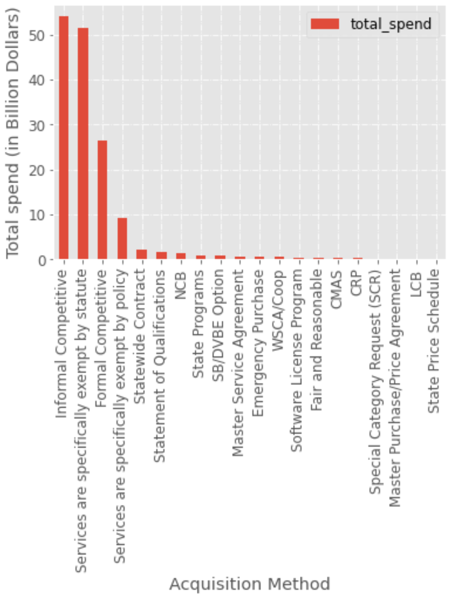

### Table of Contents
1. [Introduction](README.md#introduction)
1. [What is the structure of the data in the data set?](README.md#What-is-the-structure-of-the-data-in-the-data-set?)
1. [Do any columns in the data set make the most sense to be encoded into labels for better statistical analysis?](README.md#Do-any-columns-in-the-data-set-make-the-most-sense-to-be-encoded-into-labels-for-better-statistical-analysis?)
1. [Are there any obvious outliers or invalid/empty values in the labeled data set?](README.md#Are-there-any-obvious-outliers-or-invalid/empty-values-in-the-labeled-data-set?)
1. [What are the most expensive parts? What is the price distribution?](README.md#What-are-the-most-expensive-parts?-What-is-the-price-distribution?)
1. [Which departments are spending the most money?](README.md#Which-departments-are-spending-the-most-money?)
1. [Which zip code has the most supplier concentration? Any idea why?](README.md#Which-zip-code-has-the-most-supplier-concentration?-Any-idea-why?)
1. [What are the top UNSPSC categories?](README.md#What-are-the-top-UNSPSC-categories?)
1. [If you could spend another day cleaning up the data to make it more useful what might you do?](README.md#If-you-could-spend-another-day-cleaning-up-the-data-to-make-it-more-useful-what-might-you-do?)
1. [If you could find another data set that would complement this one to help answer the above or similar questions, what dataset might be ideal?](README.md#If-you-could-find-another-data-set-that-would-complement-this-one-to-help-answer-the-above-or-similar-questions,-what-dataset-might-be-ideal?)


#### Introduction
This repository analyzes records of Purchase Order data made publicly available by California state.

#### What is the structure of the data in the data set?
The dataset contains
- It contains 346018 rows of purchase orders with 31 columns. 
- The datatypes of all columns, as inferred by Pandas, is either object or float64.

```python
df.columns
```
<center></center><br>

- Some of the inferred datatypes (e.g. for *Unit Price* and *Total Price* columns) are incorrect, so they need to be converted to the appropriate data type before we can start analyzing the data.

```python
df["Total Price Numeric"] = df["Total Price"].apply(to_float)
df["Unit Price Numeric"] = df["Unit Price"].apply(to_float)
```

#### Do any columns in the data set make the most sense to be encoded into labels for better statistical analysis?

Nominal and ordinal data types can be encoded into labels for better statistical analysis and model building.

For example, the *Acquisition Method* is a nominal data with the following unique values

```python
df["Acquisition Method"].unique()
```

<center></center><br>

Let us create a simple bar plot of aggregate *Total Spend* per *Acuisition Method*

```python
spend_by_aq_method = df.groupby("Acquisition Method", as_index=False)\
                       .agg(number_of_purchases=("Total Price Numeric", "count"), \
                         total_spend=("Total Price Numeric", "sum"))\
                       .sort_values("total_spend", ascending=False)
```
```python
spend_by_aq_method.plot.bar(x="Acquisition Method", y="total_spend")
```

<center></center><br>

The above plot shows most of the purchases are done under the "Informal Competitive", "Services are specifically exempt by statute", "Formal Competitive", and "Services are specifically exempt by policy" acquisition methods respectively.

However, the plot looks busy and is hard to read. Encoding the acquisition method makes it cleaner.

Other columns that may benefit from label encoding:
- Acquisition Type
- Sub-Acquisition Type
- Sub-Acquisition Method

#### Are there any obvious outliers or invalid/empty values in the labeled data set?

Most of the columns have missing values. Most notably, the *Requisition Number* and *Sub-Acquisition Method* columns have 331649 (95.8% of the rows) and 315122 (91%) missing values

If we label-encode the *Sub-Acquisition Method* Column, there will be 315122 **invalid** codes with value -1, which corresponds to the NULL values in the column

<center></center><br>

#### What are the most expensive parts? What is the price distribution?

The top ten most expensive items are

```python
df.loc[df["Unit Price"].notna(), ["Item Name", "Unit Price Numeric"]]\
  .sort_values("Unit Price Numeric", ascending=False).head(10)
```

<center></center><br>

Two things become obvious from the price distribution

<center></center><br>

1. there are some *invalid* values in the *Unit Price Numeric* & *Total Price Numeric* columns since prices cannot be negative.

```python
df.loc[df["Total Price Numeric"] < 0].shape

(1438, 35)
```

2. It is also easy to see that there are outliers in these columns. The following cell illustrate this point

```python
IQR = df["Total Price Numeric"].quantile(0.75) - df["Total Price Numeric"].quantile(0.25) 
df[df["Total Price Numeric"] > 3*IQR].shape

(45294, 35)
```

If we cut-off the maximum price at $100,000, we'll get the following price distribution

```python
expensive_items = df["Total Price Numeric"] > 1e5 # Roughly 92 percentile
invalid_item_price = df["Total Price Numeric"] < 0
total_price_hist = df.loc[(~expensive_items) & (~invalid_item_price), "Total Price Numeric"].plot(kind="hist", bins=20, ec='black')
total_price_hist.set_xlabel("Total Price ($)")
```

<center></center><br>

About half of the purchases are cheaper than $5000 dollars, and about 90\% of the purchases are less than $100,000

#### How has Purchase Order spend been trending over time?

```python
df["Creation Year"] = pd.to_datetime(df["Creation Date"]).dt.to_period('Y')
valid_price = df["Total Price Numeric"] >= 0

spend_trend = df[valid_price].groupby("Creation Year", as_index=False).agg(Spend=("Total Price Numeric", "sum"))
```
<center></center><br>

In general, the spending trend over the years has been growing. The spike in 2013 is the result of a few high-dollar spends whose actual purchase date backdates the creation date.

#### Which departments are spending the most money?

The top 10 departments that are spending the most money are
```python
spend_per_dept = df.groupby("Department Name", as_index=False).agg(num_of_purchases=("Total Price Numeric","count"), total_spend=("Total Price Numeric","sum")).sort_values("total_spend", ascending=False)
spend_per_dept["pct_of_total"] = spend_per_dept["total_spend"].apply(lambda x: round(100 *(x/spend_per_dept["total_spend"].sum()),2))
spend_per_dept.head(10)
```
<center></center><br>

About 66% of the spending comes from the Department of Health Care Services.
Departments of Public Health and Social Services are distant second and third, 
each of them spending about 3.7% of the total.

#### Which zip code has the most supplier concentration? Any idea why?

Zip Code 95691 has the most supplier concentration with  11095 (around 4%) of the purchases originating from that zip code.

```python
df["Supplier Zip Code"].value_counts()

95691         11095
95814         10921
95696          8518
95827          7159
95841          7008
              ...  
53141-1410        1
11201             1
2134              1
91386             1
55044             1
```

Let us check the suppliers located in zip code 95691 and how many purchases are made from them

```python
df.loc[df["Supplier Zip Code"] == '95691', "Supplier Name"].value_counts()

Grainger Industrial Supply                   9441
MMG Technology Group Inc                      310
Paper Distributors Inc                        219
NOR CAL PERFORMANCE                           135
ANCHOR SUPPLY                                 105
                                             ... 
AFM ENVIRONMENTAL, INC                          1
Michael Palmer                                  1
Kutsch, Inc. dba: B&R Head & Block Repair       1
KEVCO, INC.                                     1
Graebel                                         1
Name: Supplier Name, Length: 93, dtype: int64
```

Out of 11095 purchases made from suppliers in zip code 95691, 9441 (about 85%) of the purchases are made from *Grainger Industrial Supply*

Let's go a bit deeper and see the Acquisition Methods used to purchase from Grainger Industrial Supply

```python
df.loc[df["Supplier Name"] == "Grainger Industrial Supply", "Acquisition Method"].value_counts()

WSCA/Coop                                     9267
Informal Competitive                           105
Fair and Reasonable                             62
SB/DVBE Option                                   2
Formal Competitive                               2
State Programs                                   1
Services are specifically exempt by policy       1
NCB                                              1
Name: Acquisition Method, dtype: int64
```

9267 (more than 98%) of the purchases made from *Grainger Industrial Supply* are of type *WSCA/Coop* Acquisition Method.

#### What are the top UNSPSC categories? 

Assumptions: 
1. I assume that "UNSPSC categories" corresponds to the "Family Title" column 
2. Since it is not explicitly mentioned, I assumed that "top" refers to the highest number of purchases instead of total amount.

With these assumption, the top 10 UNSPSC categories by number of purchases are
```python
top_unspsc = df.groupby("Family Title", as_index=False)\
    .agg(count=("Family Title", "count"), total_spend=("Total Price Numeric", "sum"))\
    .sort_values(["count", "total_spend"], ascending=False)
top_unspsc.head(10)

	Family Title	                                    count	total_spend
265	Office machines and their supplies and accesso...   16479	$88,940,549
150	Fuels                                               14599	$288,534,768
59	Computer services                                   13946	$1,547,035,757
58	Computer Equipment and Accessories                  13851	$273,810,522
285	Paper products	                                    10772	$117,600,163
394	Vocational training                                 9785	$1,859,963,869
266	Office supplies	                                    9342	$31,120,654
358	Software                                            8274	$1,255,535,652
335	Refuse disposal and treatment	                    5433	$155,610,528
0	Accommodation furniture	                            5177	$80,508,132
```

#### If you could spend another day cleaning up the data to make it more useful what might you do?

#### If you could find another data set that would complement this one to help answer the above or similar questions, what dataset might be ideal?